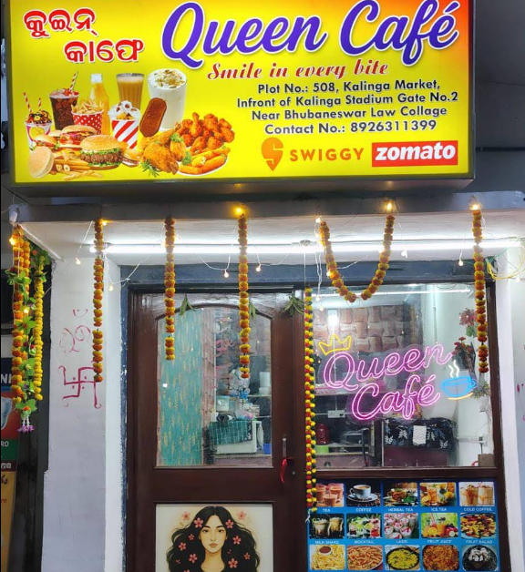
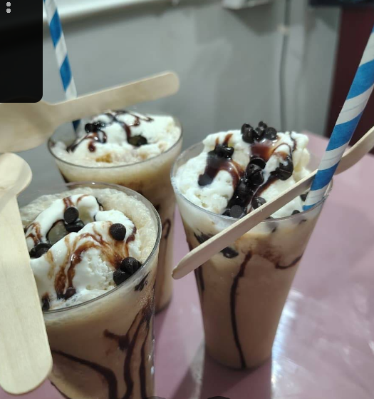
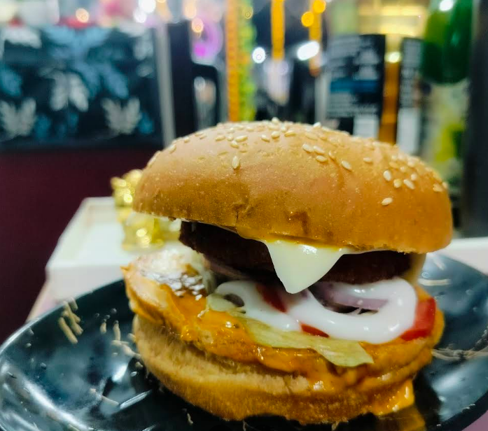
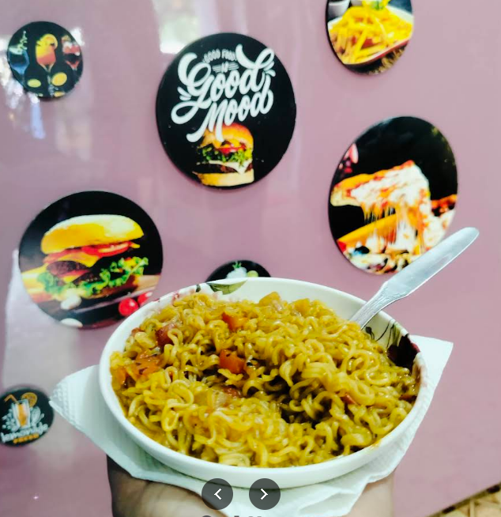

# 👑 Queen Café – Responsive Landing Page

A modern, responsive, and visually appealing landing page for **Queen Café**, a cozy café located near **Kalinga Stadium, Bhubaneswar**.

The website showcases the café's delicious food, beverages, ambiance, customer reviews, and contact information while providing an engaging user experience with smooth animations and interactive elements.

---

## 🌟 Live Preview

A premium café-themed landing page featuring:

- Responsive Design
- Interactive Menu Filtering
- Animated Hero Section
- Gallery Lightbox
- Customer Testimonials
- Contact & Location Information
- Smooth Scrolling Navigation
- Modern UI/UX

---

## 📸 Project Screenshots

### Hero Section


### Signature Cold Coffee


### Queen Special Burger


### Loaded Maggi


---

## 🚀 Features

### 🎨 Modern UI Design
- Premium café-inspired theme
- Elegant typography
- Glassmorphism effects
- Smooth hover animations
- Responsive layout

### 📱 Fully Responsive
- Desktop
- Tablet
- Mobile devices

### 🍔 Interactive Menu
- Category filtering
- Smooth transitions
- Food cards with pricing
- Ratings and preparation times

### 🖼 Gallery Section
- Lightbox image preview
- Interactive hover effects
- Responsive gallery layout

### ⭐ Customer Testimonials
- Real customer reviews
- Rating display
- Attractive testimonial cards

### 📍 Contact Section
- Café address
- Phone number
- Location information
- Order CTA buttons

---

## 🛠️ Technologies Used

### Frontend
- HTML5
- CSS3
- JavaScript (ES6)

### Frameworks & Libraries
- Bootstrap 5.3
- Bootstrap Icons
- Google Fonts

### Design Features
- CSS Variables
- CSS Grid
- Flexbox
- Animations
- Intersection Observer API

---

## 📂 Project Structure

```bash
Queen-Cafe/
│
├── index.html
├── styles.css
├── script.js
│
├── images/
│   ├── real-storefront.png
│   ├── real-neon-sign.png
│   ├── real-burger.png
│   ├── real-cold-coffee.png
│   ├── real-noodles.png
│   ├── real-fries.png
│   ├── cheese-pizza.png
│   └── ...
│
└── README.md
```

---

## 🎯 Sections Included

### 🏠 Hero Section
- Eye-catching introduction
- CTA buttons
- Statistics section

### ☕ About Section
- Queen Café story
- Features and services

### 🍕 Menu Section
- Cold Coffee
- Burgers
- Pizza
- Fries
- Maggi
- Herbal Tea

### ✨ Why Choose Us
- Fresh Ingredients
- Budget Friendly
- Friendly Staff
- Quick Service

### 📸 Gallery
- Café ambiance
- Food highlights
- Interior showcase

### 💬 Testimonials
- Customer reviews
- Ratings

### 📞 Contact
- Phone number
- Address
- Directions

---

## 📍 Café Information

**Queen Café**

📌 Plot No. 508, Kalinga Market  
📌 In Front of Kalinga Stadium Gate No. 2  
📌 Near Bhubaneswar Law College  
📌 Bhubaneswar, Odisha

📞 Phone: +91 89263 11399

🍽 Available On:
- Swiggy
- Zomato

---

## 📈 Future Improvements

- Online Ordering System
- Reservation Booking
- Admin Dashboard
- Customer Feedback Form
- Dark Mode
- Backend Integration
- Payment Gateway

---

## 🤝 Contributing

Contributions, issues, and feature requests are welcome.

Feel free to fork the project and submit a pull request.

---

## ❤️ Developed For

**Queen Café**
*"Smile in Every Bite"* 👑☕

Made with ❤️ using HTML, CSS, JavaScript & Bootstrap.
